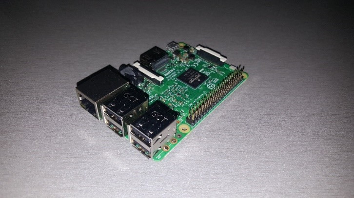
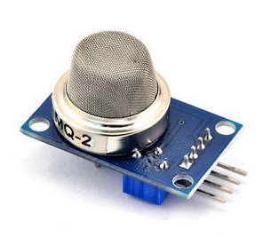
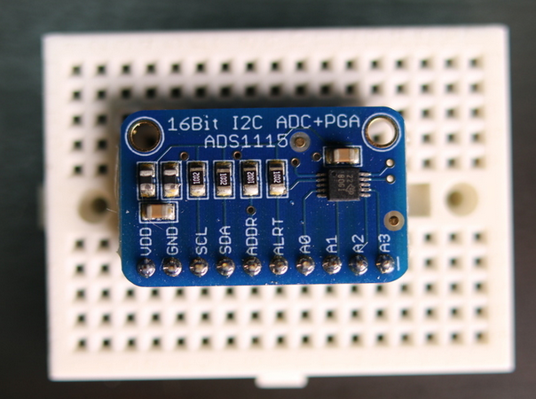
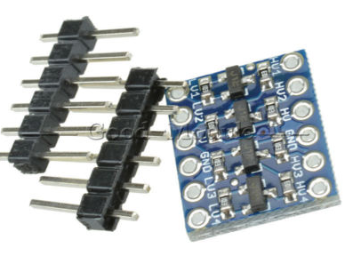

# Domestic-gas-leakage-detection

The Rpi tracks the concentration of LPG/CO/Smoke in the air and plots graph lines on Thingspeak
A warming message is sent over email if the gas concentration is too high.

An Internet of Things project using:

1. Raspberry Pi 3B
2. MQ - 2 Gas Sensor (LPG/CO/Smoke)
3. ADC - ADS 1115
4. Logic Level Shifter
5. Breadboard and Jumper Wires

### Wiring

* VCC, VDD, HV (Sensor, ADC, LLC) -> 5V (Rpi)
* LV (LLC) -> 3.3V (Rpi)
* GND (Sensor, ADC, LLC) -> GND (Rpi)
* A0 (Sensor) -> A0 (ADC)
* SCL (ADC) -> HV1 (LLC), LV1 -> SCL (Rpi)
* SDA (ADC) -> HV2 (LLC), LV2 -> SDA (Rpi)
